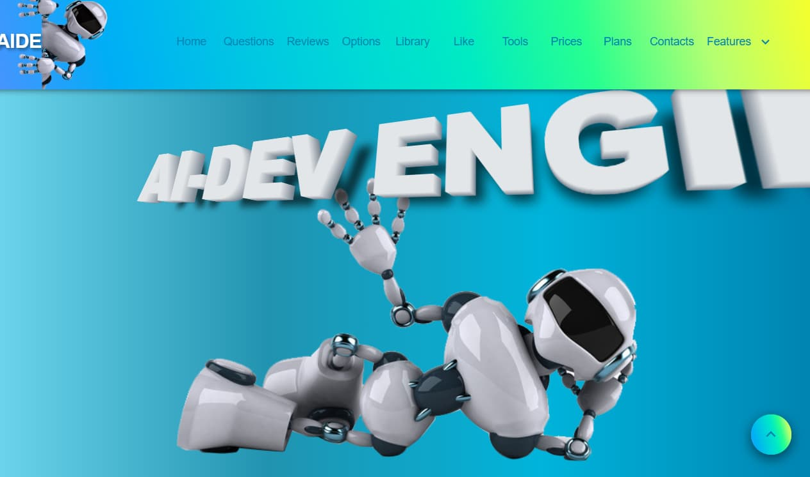
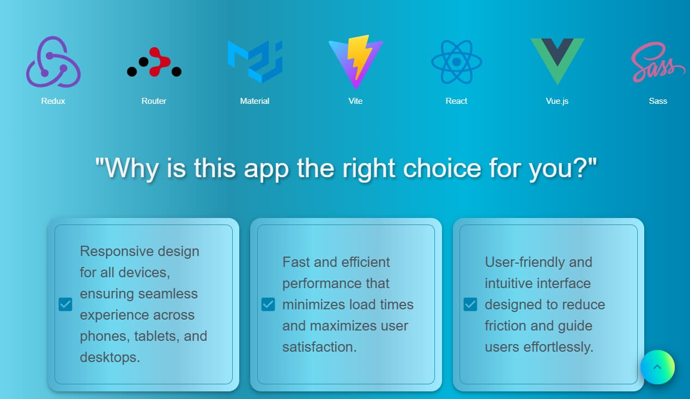
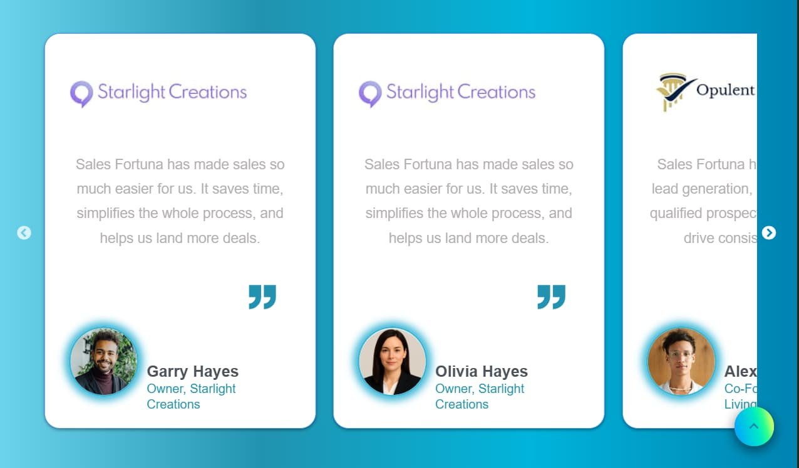
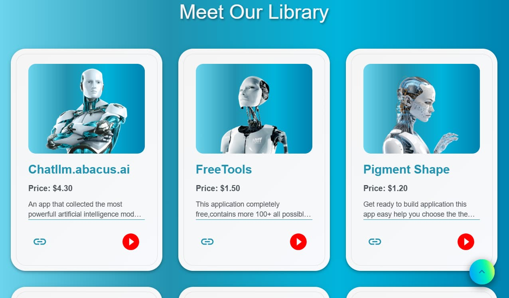
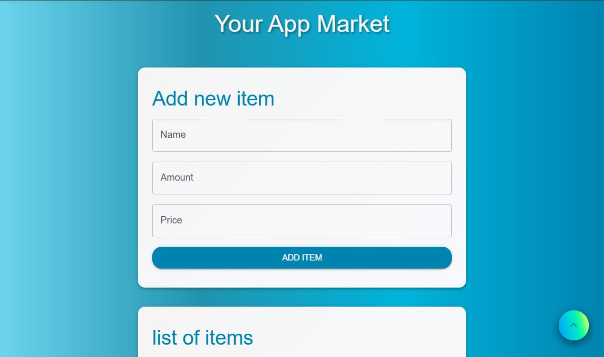
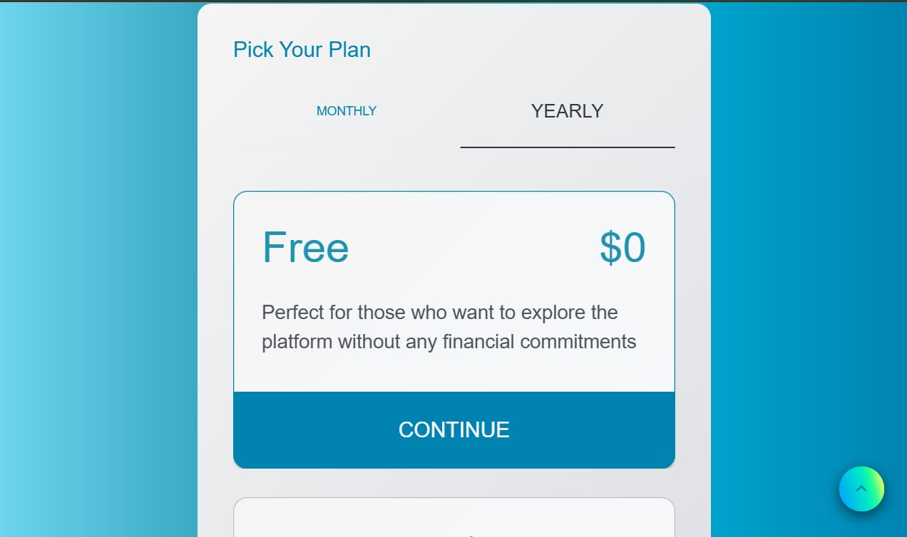

# React + Vite

# 🌐 AIDE-tools development

> Built to inspire developers and showcase modern UI/UX techniques.

_AIDE_ is a modern React-based landing page that showcases useful AI tools,
educational resources, and interactive UI components. _This app is perfect for
developers looking to explore, learn, and stay inspired._

---

## Features

- 3D animated hero section
- Interactive cards with:
  - opacity transitions
  - horizontal sliding animations
- Responsive grid layout with animated content blocks
- Dynamic form to:
  - add items with price and quantity
  - calculate total cost and item count
- Subscription component using `ref` to preserve user selections
- Mobile-friendly navigation with adaptive menu
- Section with curated links to official documentation and learning platforms

* **Responsive slider implemented using React Slick**
  - Displays content in a carousel format
  - Fully adapted for various screen sizes and devices
  - Smooth transitions and customizable settings

---

## Technologies Used

1. Core Stack
   - React + Vite
   - Redux Toolkit + Redux Persist
   - Material UI
2. Animation & Interaction

   - 3D animation
   - Framer Motion
   - React Slick

3. Styling & Layout

   - Material UI Styled
   - Responsive Grid System

---

## Gallery Preview

  
  
  
  
  
  

---

## Learn & Explore

The app includes a section with curated links to:

- **Official documentation**

  - React
  - Redux
  - Material UI
  - Framer Motion and more

- **AI tools and libraries**

  - Useful for frontend and creative development

  ***

## Getting Started

_To set up the project locally, follow these steps:_

1. _Clone the repository_  
   To get started with the project, clone the repository using

   `git clone https://github.com/username/slider-test.git `

2. _Navigate into the project folder with_

`cd slider-test`

3.  _Install all dependencies by running_

`npm install`

4. _Finally start the development server using_

`npm run dev`
